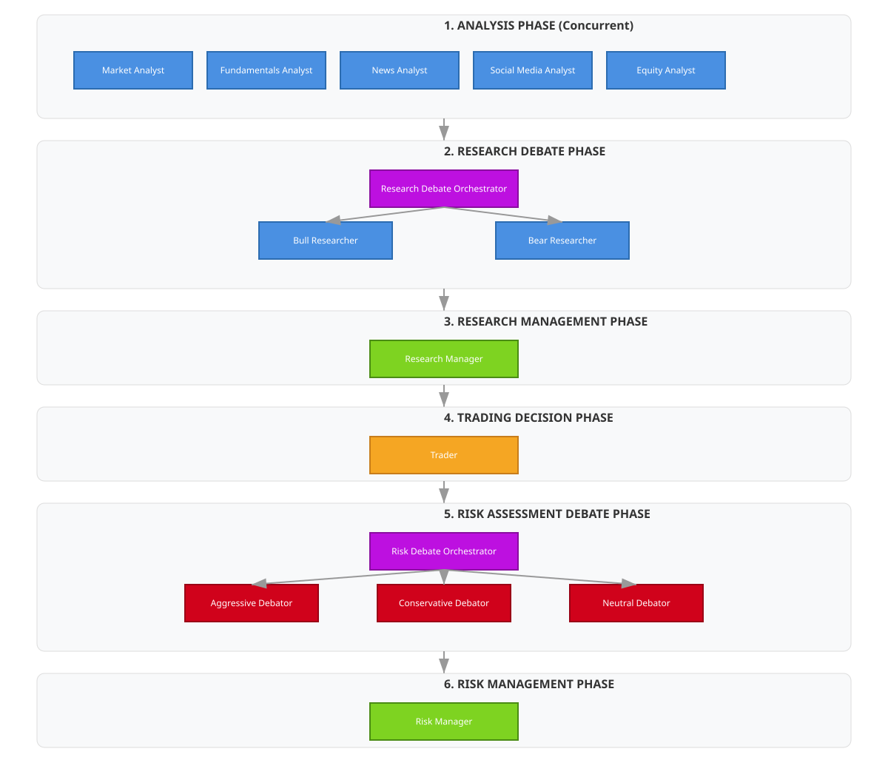

# Trading Agents Documentation

This project implements a comprehensive multi-agent trading system built with the AgentScope framework. The system follows a hierarchical architecture with specialized agents for different aspects of trading analysis and decision-making.

## System Architecture

The trading system consists of five main agent modules:

1. **Analysts** - Fundamental and technical analysis
2. **Researchers** - Bull/Bear market research and debate
3. **Risk Management** - Multi-agent risk assessment and debate
4. **Managers** - Coordination and decision synthesis
5. **Trader** - Final trading decisions

## Agent Modules

### 1. Analysts

The analyst agents perform specialized data analysis on stocks:

- **Market Analyst** (`analysts/market_analyst.py`) - Performs technical analysis using market data and indicators
- **Fundamentals Analyst** (`analysts/fundamentals_analyst.py`) - Analyzes company financial statements, balance sheets, cash flows, and income statements
- **News Analyst** (`analysts/news_analyst.py`) - Analyzes recent news related to the company and market
- **Social Media Analyst** (`analysts/social_media_analyst.py`) - Analyzes social media sentiment and public perception
- **Equity Analyst** (`analysts/equity_analyst.py`) - Performs comprehensive equity valuation analysis using various models

### 2. Researchers

The researcher agents debate market outlooks:

- **Bull Researcher** (`researchers/bull_researcher.py`) - Advocates for bullish market positions
- **Bear Researcher** (`researchers/bear_researcher.py`) - Advocates for bearish market positions
- **Research Debate Orchestrator** (`researchers/debate_orchestrator.py`) - Coordinates debates between bull and bear researchers

### 3. Risk Management

The risk management system implements a multi-agent debate pattern where different risk perspectives are evaluated:

- **Aggressive Debator** (`risk_mgmt/aggressive_debator.py`) - Advocates for high-return, high-risk investment opportunities
- **Conservative Debator** (`risk_mgmt/conservative_debator.py`) - Focuses on protecting assets and minimizing volatility
- **Neutral Debator** (`risk_mgmt/neutral_debator.py`) - Provides a balanced perspective weighing potential gains and risks
- **Portfolio Manager** (`managers/portfolio_manager.py`) - Evaluates the debate and makes the final risk assessment
- **Risk Debate Orchestrator** (`risk_mgmt/debate_orchestrator.py`) - Coordinates the risk management debate

### 4. Managers

The manager agents coordinate different phases and synthesize results:

- **Research Manager** (`managers/research_manager.py`) - Synthesizes the research debate results into investment recommendations
- **Portfolio Manager** (`managers/portfolio_manager.py`) - Evaluates the risk debate and makes the final risk-adjusted trading decision

### 5. Trader

The trader agent makes final trading decisions:

- **Trader** (`trader/trader.py`) - Makes final buy/sell/hold decisions based on all analysis and risk assessments

## Complete Workflow Architecture

The system follows a comprehensive multi-stage workflow defined in `workflow.py`. The diagram below illustrates the complete data flow and interaction between all agents:

<p align="center">
  
</p>

## Workflow Stages

1. **Analysis Phase**: All analyst agents (Market, Fundamentals, News, Social Media, Equity) run concurrently to gather comprehensive data about the stock
2. **Research Debate Phase**: Bull and bear researchers debate based on analyst reports, coordinated by Research Debate Orchestrator
3. **Research Management**: Research manager synthesizes the debate into investment recommendations
4. **Trading Decision**: Trader makes trading decisions based on all analysis and research findings
5. **Risk Assessment Debate**: Risk management team (Aggressive, Conservative, Neutral debators) debates the trading decision, coordinated by Risk Debate Orchestrator
6. **Risk Management**: Portfolio manager evaluates the debate and makes the final risk-adjusted trading decision
7. **Final Report**: All findings are compiled into a comprehensive report

## Usage

```python
from tradingscope.agents.workflow import analyze
from agentscope.model import DashScopeChatModel

# Model configuration
model_config = {
    "model_name": "qwen-plus",
    "api_key": "your-dashscope-api-key",
}

model = DashScopeChatModel(**model_config)

# Run complete analysis
report = await analyze(model=model, ticker="TSLA", trade_date="2025-10-16")
```

## Risk Management Debate System

The risk management debate system implements a multi-agent debate pattern where three risk analysts with different perspectives debate investment decisions:

### Risk Management Agents

- **Aggressive Debator**: Advocates for high-return, high-risk investment opportunities
- **Conservative Debator**: Focuses on protecting assets and minimizing volatility
- **Neutral Debator**: Provides a balanced perspective weighing potential gains and risks
- **Portfolio Manager**: Evaluates the debate and makes the final risk assessment

### Direct Usage

```python
from tradingscope.agents.risk_mgmt.debate_orchestrator import create_debate_orchestrator

# Model configuration
model_config = {
    "model_name": "gpt-4o-mini",
    "api_key": "your-api-key",
}

# Create orchestrator
orchestrator = create_debate_orchestrator(model_config, max_rounds=3)

# Run debate
final_decision = await orchestrator.run_debate(
    company_name="TSLA",
    trader_plan="Plan to buy 200 shares of TSLA",
    market_research_report="Market analysis data...",
    sentiment_report="Social media sentiment...",
    news_report="Latest world affairs...",
    fundamentals_report="Company fundamentals..."
)
```